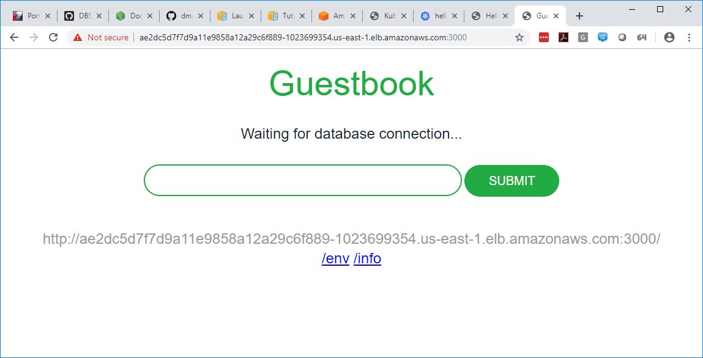
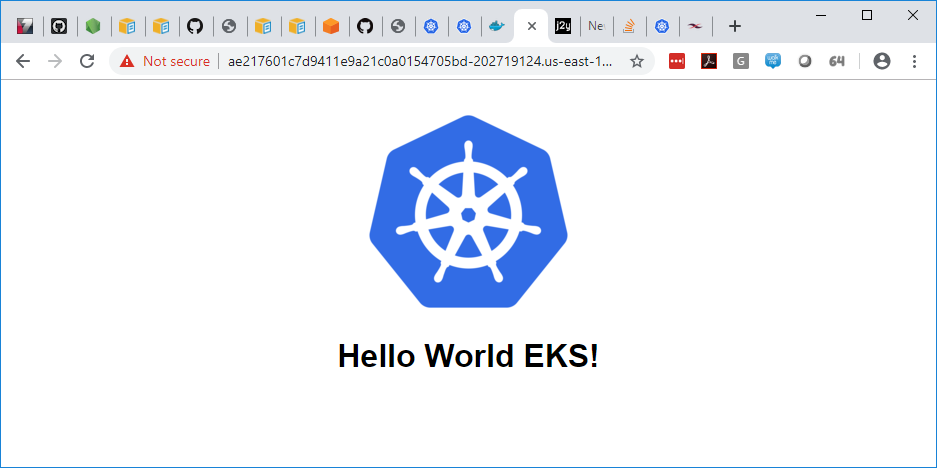

# Amazon EKS - First Time Customer Feedback

## Overview 

As a new EKS user I've documented my experience while following the [Getting Started Guide](https://docs.aws.amazon.com/eks/latest/userguide/getting-started-console.html) and also setting up and deploying my own simple application on EKS. The intention of this document is to provide AWS constructive feedback and suggestions for improvement from a first time EKS user experience. In this document I provide comments on various sections/tutorials.


### Getting Started Section: Create your Amazon EKS Service Role

Here's an observation I had while creating a cluster using the EKS management console. The first screen of the 'Create Cluster' page has a number of required fields. In some cases it's not possible to to create a cluster without reading the getting started guide. Here's an example:

If creating a new IAM role is a prerequisite for an EKS cluster, then the managment console should more easily allow you to create this role without having to leave the 'Create Cluster' management screen. It navigates to the IAM Management screen and you don't know what to do there unless you're also reading the [Getting Started Guide](https://docs.aws.amazon.com/eks/latest/userguide/getting-started-console.html) at the same time.


### Getting Started Section: Create your Amazon EKS Cluster VPC

In the section "Create your Amazon EKS Cluster VPC", the getting started guide walks new EKS users through the process of creating a new VPC for a kubernetes cluster. The document provides a CloudFormation template so that the user can create a VPC. This seems a bit cumbersome for a getting started guide. Shouldn't the guide assume that a new user will use the default VPC to quickly get up and running? The notes regarding VPC isolation are valid and should be noted for production deployments. One question I have regarding this level of isolation is if it will make it harder for applications deployed in EKS to integrate with services deployed in other VPCs (Example: RDS)?

> You must also create a VPC and a security group for your cluster to use. Although the VPC and security groups can be used for multiple EKS clusters, we recommend that you use a separate VPC for each EKS cluster to provide better network isolation.

If creating a new VPC is such a critical part of setting up a new cluster then I would suggest building that workflow right into the EKS management console interfaces, rather than asking the new user to run "one-off" CloudFormation scripts. This gives the EKS product the appearence of being "half-baked". Also, it sends new users down a rabbit hole (what is CloudFormation? what does this script do?, etc..), new EKS users should be able to focus on using Kubernetes.

One more small observation is that the after running the VPC CloudFormation script, the document later references a security group that was created under "Step 1: Create Your Amazon EKS Cluster". From a new EKS user perspective my thoughts where, "What is all the infrastruction being generated under the covers to create a cluster that I need to know about which I'm not learning as part of this tutorial?"

### Getting Started Section: Step 3: Launch and Configure Amazon EKS Worker Nodes

As a new EKS user I've now created my kubernetes cluster and am ready to start deploying some containers.... Oh wait.
When looking at "EKS -> Clusters -> mycluster", I don't see anywhere manage my worker nodes. I would expect that as a platform managed service, that the management console would allow me to manage my cluster (including it's worker nodes) via the manage console UI. Alas, I must refer to the getting started guide where I find that once again I must run CloudFormation scripts in order to accomplish this. If I compare the ElasticSearch Service to EKS with this regarding, the ElasticSearch Service management console makes it very easy for me to manage how many nodes are in my cluster. 

As I continue to follow this section of the getting started guide there definatley some small improvements that would go a long way towards usablity. When using the CloudFormation script:
- Providing the ClusterName, why can't this be a drop down with my cluster already there?
- Providing the ClusterControlPlaneSecurityGroup, can't this be selected based on what cluster name I choose?
- Providing the NodeGroupName, can't some meaningful name be generated based on my cluster name?
- Providing the NodeImageId, This one really needs to be a dropdown. Without having to refer to the getting started guide I would have no idea what to enter. Also, can't the UI just know this based on what Region I'm executing the script in?
- Providing the KeyName, I should be able to create a key right then and there if one doesn't exist like when I create an EC2 instance.
- Providing the Worker Network Configuration, this feels very redundant, can't the UI pre-select based on where I created the cluster?

Here's another thing that I think is a bit of an issue:
```
10. When your stack has finished creating, select it in the console and choose the Outputs tab.

11. Record the NodeInstanceRole for the node group that was created. You need this when you configure your Amazon EKS worker nodes.
```
As a new EKS user I shouldn't have to take note, copy & paste, or write things down to use later. The platform should carry this data along as a user progresses through a workflow. The NodeInstanceRole is used as part of the next set of steps "To enable worker nodes to join your cluster" which is really starting to get into the weeds. As part of this process I need to download a script from S3, edit it (using the NodeInstanceRole created above), and apply it using the kubectl command.  

All in all, this is alot of work just to get some nodes in my new cluster. It's very manual, error prone, and non-user friendly.

I understand that most of these limitations are due to the fact that I'm running a CloudFormation script but a properly built UI could drastically improve user experience. 

After completing the steps I was finally able to complete the creation of my kubernetes cluster and worker nodes. Now on to trying to deploy my containers.

## Tutorial: Launch a Guest Book Application 

After creating my cluster, I began this tutorial to fiqure out how to deploy my application in my new k8s cluster. 
At this point things are pretty striaght forward and able to use the 'kubectl' command which we all know and love.

I ran through the "kubectl apply..." commands pretty quickly, however when I tried to go to the app there appeared to be an issue even after I waited for a bit.



Looking at the pods I see:
```
dmchugh@dmchugh-005948:/mnt/c/Workspaces/hello-world-eks/k8s$ kubectl get pods
NAME                 READY     STATUS             RESTARTS   AGE
guestbook-b2f7x      1/1       Running            0          7m54s
guestbook-tv6m5      1/1       Running            0          7m54s
guestbook-vd8pb      1/1       Running            0          7m54s
redis-master-rbzwb   1/1       Running            0          8m53s
redis-slave-sbpnr    0/1       ImagePullBackOff   0          8m17s
redis-slave-snlmw    0/1       ImagePullBackOff   0          8m17s
dmchugh@dmchugh-005948:/mnt/c/Workspaces/hello-world-eks/k8s$
```

So for some reason kubernetes was unable to pull some of the container images...
Most of the app launched and for instructional purposes I got the point. For a better learning experience it might be worth having a new EKS customer try and launch their own app. Afterall that's why we're here :)

## Launching My Own Application

So here are the steps I took to create my own application.
The benefit here is that it ties ECR into the picture and gives the new EKS user a bit more engagement rather than just blindly running kubectl commands like the Guest Book Tutorial.

1. I created a simple nodejs application which when run shows a single webpage (under the node-app folder)
2. Created a Dockerfile so that the app can be started by running 'docker run -p 8080:8080 dmchugh777/hello-world-eks'
3. I pushed the docker image to [my dockerhub account](https://cloud.docker.com/repository/registry-1.docker.io/dmchugh777/hello-world-eks)
4. I created deployment and service specs under node-app/k8s. The dockerhub-deployment.yaml pulls the image from dockerhub.
5. I deployed the yaml specs using kubectl

```
dmchugh@dmchugh-005948:/mnt/c/Workspaces/hello-world-eks/k8s$ kubectl apply -f dockerhub-deployment.yaml
deployment.apps/hello-world-eks-deployment created
dmchugh@dmchugh-005948:/mnt/c/Workspaces/hello-world-eks/k8s$ kubectl get pods
NAME                                          READY     STATUS    RESTARTS   AGE
hello-world-eks-deployment-6c788b4fcb-br6hs   1/1       Running   0          16s
hello-world-eks-deployment-6c788b4fcb-qvkqj   1/1       Running   0          16s
hello-world-eks-deployment-6c788b4fcb-x74p7   1/1       Running   0          16s
dmchugh@dmchugh-005948:/mnt/c/Workspaces/hello-world-eks/k8s$
```
Looks good!

```
dmchugh@dmchugh-005948:/mnt/c/Workspaces/hello-world-eks/k8s$ kubectl apply -f service.yaml
service/hello-world-eks created
dmchugh@dmchugh-005948:/mnt/c/Workspaces/hello-world-eks/k8s$ kubectl get services -o wide
NAME              TYPE           CLUSTER-IP       EXTERNAL-IP                                                              PORT(S)          AGE       SELECTOR
hello-world-eks   LoadBalancer   10.100.132.144   ae217601c7d9411e9a21c0a0154705bd-202719124.us-east-1.elb.amazonaws.com   8080:32450/TCP   13s       app=hello-world-eks
kubernetes        ClusterIP      10.100.0.1       <none>                                                                   443/TCP          161m      <none>
dmchugh@dmchugh-005948:/mnt/c/Workspaces/hello-world-eks/k8s$
```
Looks good and it deployed!



6. So next I pushed my image to Amazon ECS so that my docker images are within my Amazon AWS account and not dockerhub.
   - I followed the ["Docker Basics for Amazon ECS" Guide](https://docs.aws.amazon.com/AmazonECS/latest/developerguide/docker-basics.html)
   - I created the repo "hello-world-eks-repo" in ECR
   - I tagged my image locally "docker tag dmchugh777/hello-world-eks 977769338170.dkr.ecr.us-east-1.amazonaws.com/hello-world-eks-repo"
   - I got my login command using "aws ecr get-login --no-include-email --no-verify-ssl"
   - I executed the outputted login command (which worked).
   - I pushed the image to ECR "docker push 977769338170.dkr.ecr.us-east-1.amazonaws.com/hello-world-eks-repo". This also worked and I was able to verify that the image appeared in the ECR management console UI.
   - I created a new ecr-deployment.yaml and updated the image to 977769338170.dkr.ecr.us-east-1.amazonaws.com/hello-world-eks-repo:latest (as displayed in the ECR console).
   - I removed the existing deployment "kubectl delete -f dockerhub-deployment.yaml"
   - Finally I recreated the deployments using the ecr-deployment.yaml and the app was up and running again!

## Other Observations

- The docs repeatedly ask the user to check their AWS CLI and python versions. This is done in two different sections. Can't this be in another document where the Getting Started Guide references it at the beginning?
- I also followed the guide ["Tutorial: Deploy the Kubernetes Web UI (Dashboard)"](https://docs.aws.amazon.com/eks/latest/userguide/dashboard-tutorial.html). This is again alot of scripts that need to be executed, can't there be a simple option in the management console to create the dashboard for you?
- Cleanup involved mutliple steps since it involved both CloudFormation stacks and the EKS Cluster. 

## Conclusion

I think my general comments can be boiled down to the following idea, "Run less scripts and push more buttons".
Running multiple CloudFormation scripts makes me feel like EKS is not a fully managed and easy to use service. 
There are many manual steps required to create a cluster while also trying to use the management console. To create a simple EKS cluster is not possible in the management console itself which should automate most of these steps for a better first time EKS user experience.


